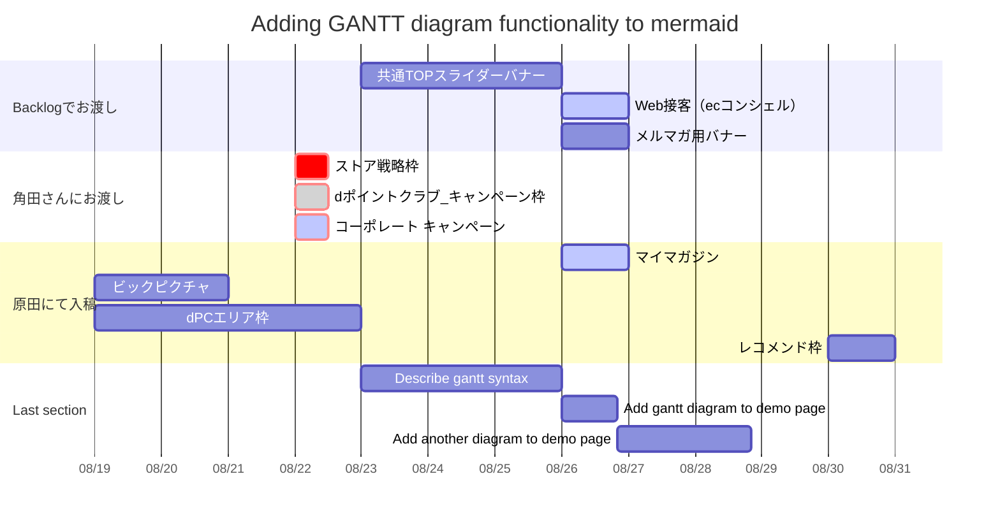
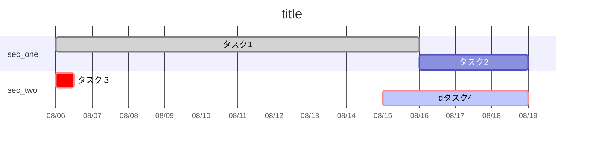

---
presentation:
  width: 800
  height: 600
  center: false
---

<!-- slide -->

```mermaid
gantt
       dateFormat  YYYY-MM-DD
       axisFormat  %m/%d
       title Adding GANTT diagram functionality to mermaid

       section Backlogでお渡し
       共通TOPスライダーバナー            :    des1, 2019-08-23,2019-08-26
       Web接客（ecコンシェル）               :active,  des2, 2019-08-26, 24h
       メルマガ用バナー              :         des3, 2019-08-26, 24h


       section 角田さんにお渡し
       ストア戦略枠 :crit,  2019-08-22,12h
       dポイントクラブ_キャンペーン枠         :crit, done, 2019-08-22,12h
       コーポレート キャンペーン             :crit, active, 2019-08-22,12h

       section 原田にて入稿
       マイマガジン              :active, 2019-08-26,2019-08-27
       ビックピクチャ     :2019-08-19,2019-08-21
       dPCエリア枠    :doc1, 2019-08-19,2019-08-23
       レコメンド枠     :2019-08-30,24h

       section Last section
       Describe gantt syntax               :after doc1, 3d
       Add gantt diagram to demo page      :20h
       Add another diagram to demo page    :48h
```

<!-- slide -->

#test

```mermaid
       gantt
       dateFormat  YYYY-MM-DD
       axisFormat  %m/%d
       title title
       section sec_one
       タスク1 :done,a1, 2019-08-06, 10d
       タスク2 :a2, after a1  , 3d
       section sec_two
       タスク３:crit,  2019-08-06,12h
       dタスク4:active,crit,  2019-08-15,4d
```
